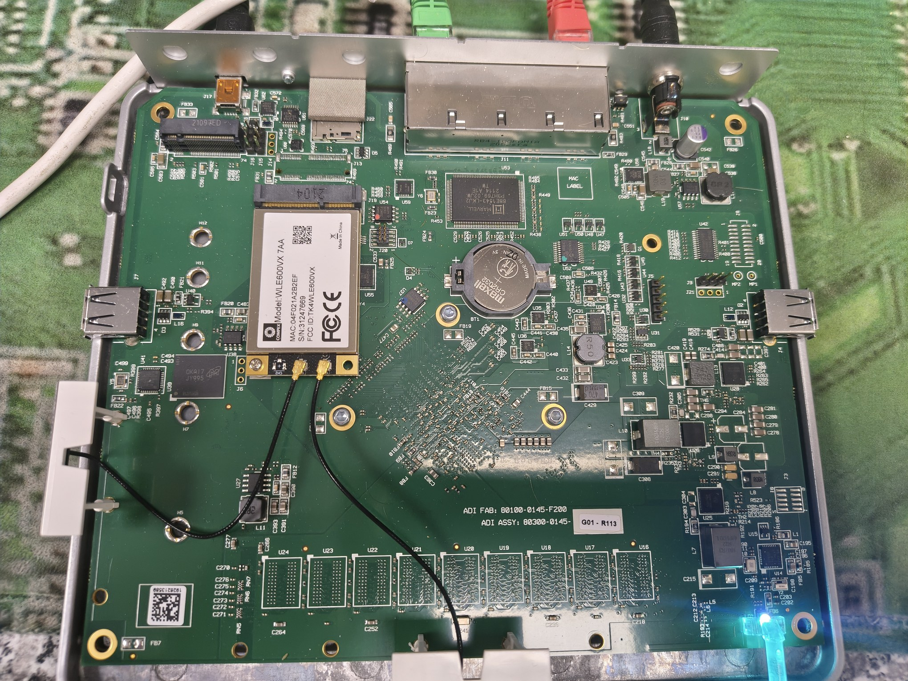
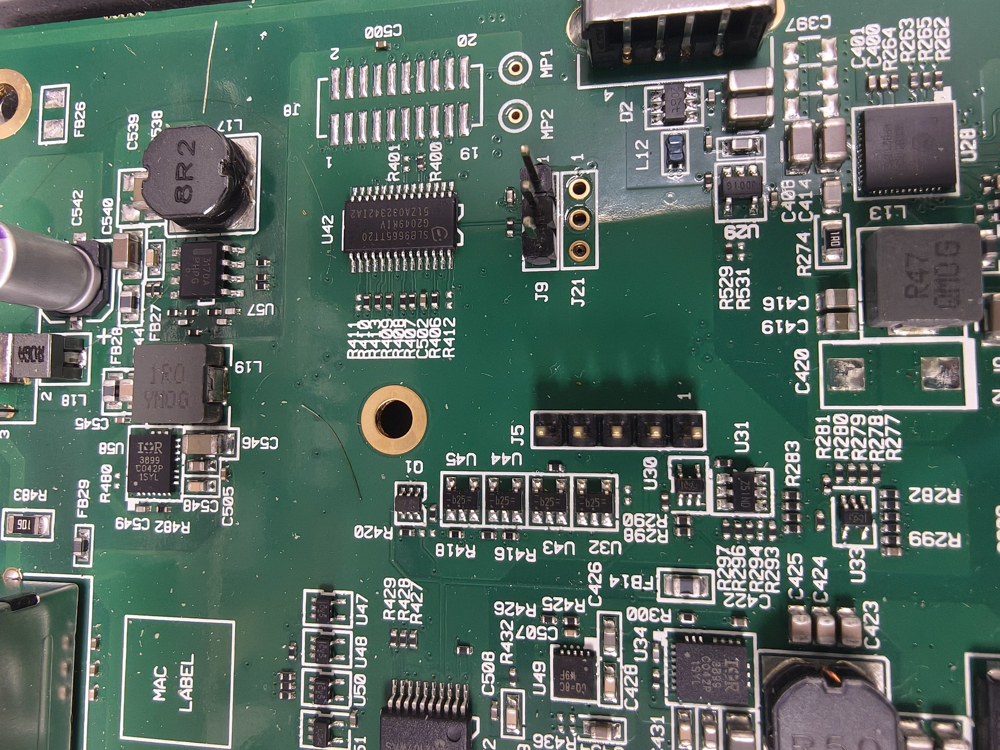
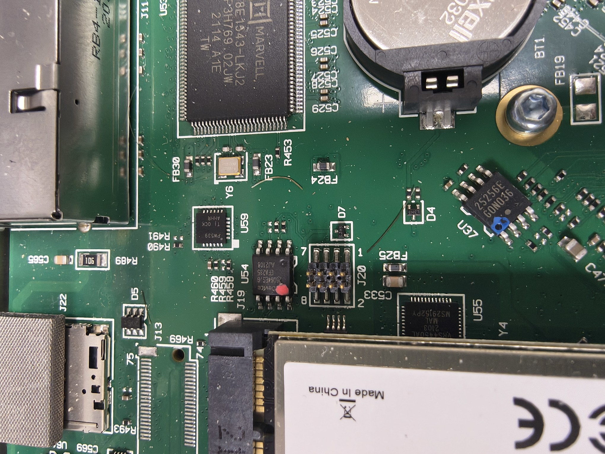
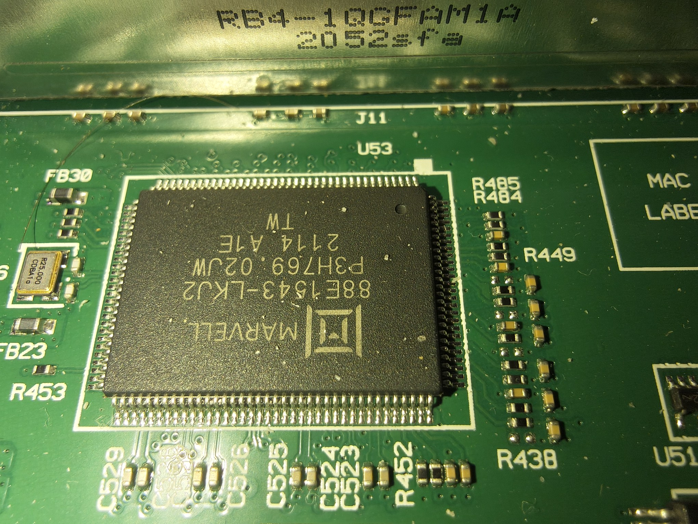
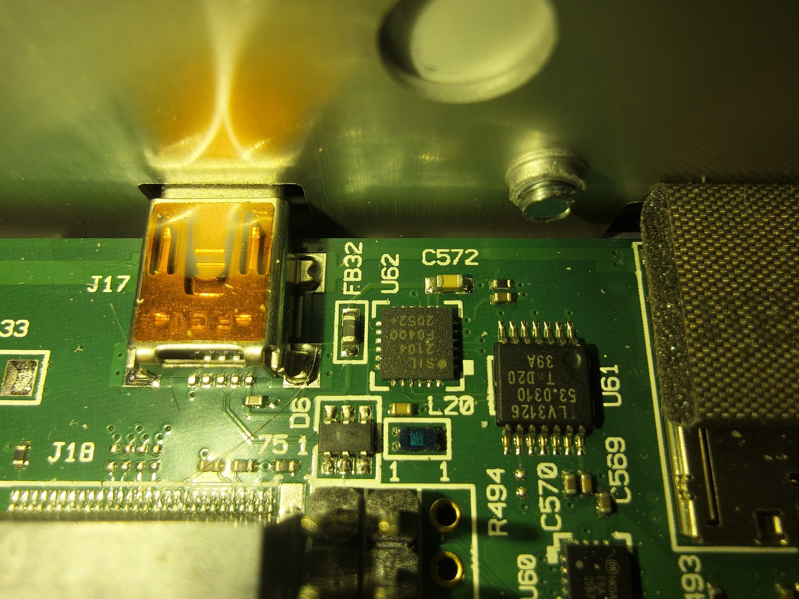
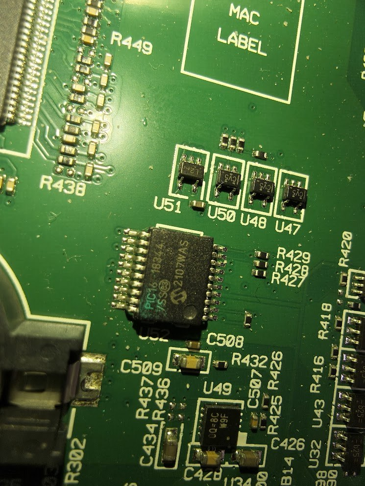
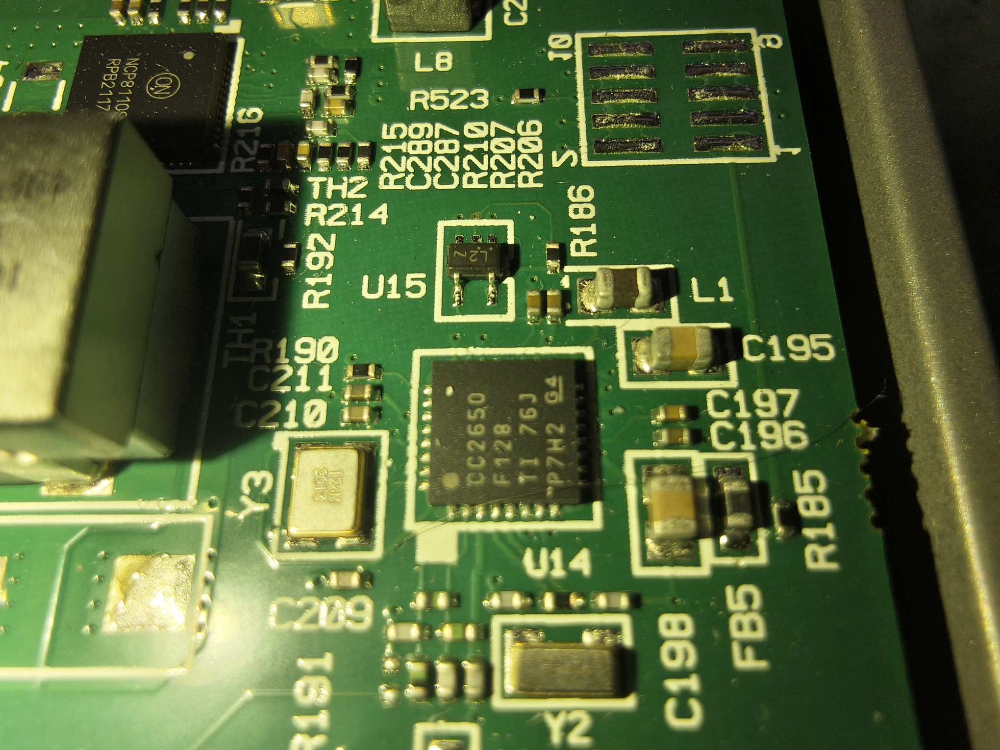
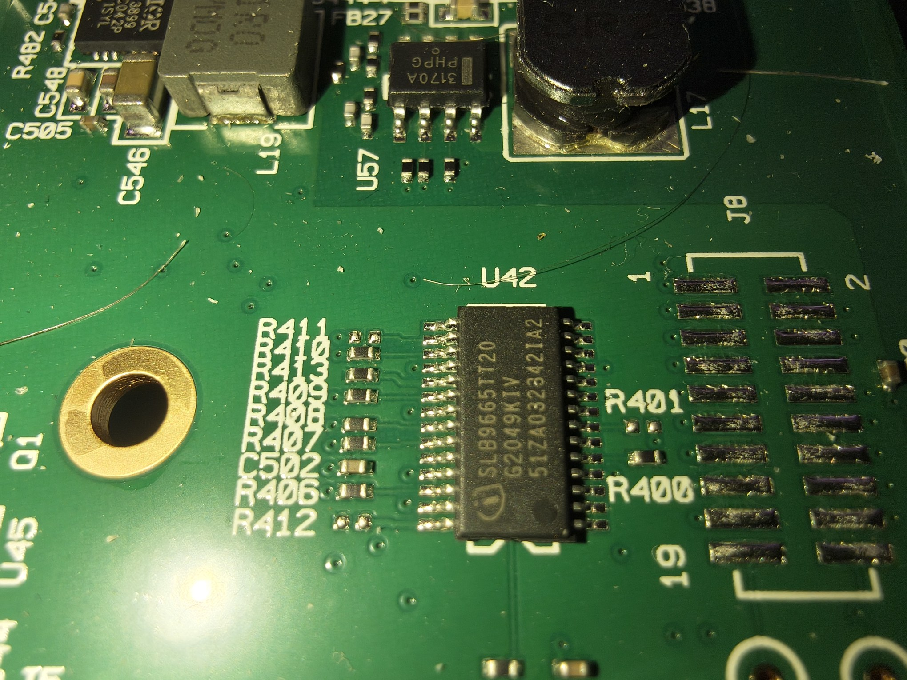

# VeloCloud Edge 510 — Board Hardware Reference

This document describes the PCB hardware of the VeloCloud Edge 510. It is intended as a
reference for hardware hackers, repair, and firmware work — not required reading for the
OPNsense conversion guide.

> **Note:** This information was gathered by visual inspection of the PCB. Some part numbers
> are confirmed from datasheets; others are best-effort from SMD markings. Corrections welcome.

---

## Board Identification

| Field | Value |
|-------|-------|
| ADI FAB | `80100-0145-F200` |
| ADI ASSY | `80300-0145` |
| Board revision | `G01-R113` |
| Chassis label | `RB4-10GFAM11A 2052sf3` |
| CMOS battery | Maxell CR2032 (3V) |

---

## Main Processor

The main x86 SoC is mounted on the **underside of the board**, thermally coupled to the metal
chassis base plate which acts as a heatsink. It is not visible with the board installed. The
processor is confirmed x86 (FreeBSD/amd64 runs natively via coreboot).

---

## Connectors and Headers

| Ref | Type | Pins | Populated | Function |
|-----|------|------|-----------|---------|
| J3 | Solder pad array | 10 | No | Unknown — connector footprint not fitted in production |
| J4 | USB-A | — | Yes | USB-A port |
| **J5** | Pin header | 5 | Yes | **Probable UART debug header** — direct serial access to SoC |
| J6 | Pin header | 3 | No (unpopulated) | Unknown — next to mini-PCIe screw, near SoC |
| J7 | USB-A | — | Yes | USB-A port |
| J8 | Solder pad array | 20 | No | Unknown — GPIO/expansion footprint, not fitted in production |
| J9 | Pin header | 3 | Yes | Unknown — power/reset area near TPM |
| J10 | DC barrel jack | — | Yes | Power input |
| J11 | 4× RJ45 | — | Yes | LAN ports (front panel) |
| J13 | Solder pad array | 75 | No | **M.2 cellular modem slot** (B/M-key, paired with J22 SIM) |
| J14 | Pin header | 3 | No (unpopulated) | Unknown — near USB-to-serial conversion circuitry |
| J15 | Pin header | 3 | Yes | Unknown — near USB-to-serial conversion circuitry |
| J16 | Pin header | 3 | Yes | Unknown — near USB-to-serial conversion circuitry |
| J17 | USB-A | — | Yes | Internal USB-A (serial conversion chain) |
| J18 | M.2 slot | — | Yes | **M.2 slot** — storage SSD |
| J19 | mini-PCIe | — | Yes | mini-PCIe slot (WLE600VX wireless card fitted as standard) |
| J20 | Pin header | 8 (2×4) | Yes | **Probable JTAG / SPI programming interface** (next to SPI flash U54) |
| J21 | Pin header | 3 | No (unpopulated) | Unknown — near J9, power management area |
| J22 | SIM card slot | — | Yes | SIM slot — paired with J13 cellular M.2 |

> J1, J2, J12 were not identified from available photos — may be on the underside or obscured.

### J5 — UART Debug Header

J5 is a populated 5-pin header in the centre of the board. 5-pin UART headers on embedded
appliances typically carry VCC, GND, TX, RX, and a reset or key pin. Pinout has not been
confirmed — probe with a multimeter before connecting.

### J20 — JTAG / SPI Programming

J20 is a populated 2×4 (8-pin) header immediately adjacent to the SPI NOR flash chip (U54).
Standard JTAG pinouts use 7 signals (TDI, TDO, TCK, TMS, TRST, GND, VCC) fitting an 8-pin
header. Useful for firmware recovery if U54 is ever corrupted.

### J13 + J22 — Cellular Modem Slot

J13 is a 75-pin M.2 solder pad array (B/M-key footprint, connector not fitted in standard
Edge 510). J22 is the paired SIM card slot. Together these support an M.2 cellular modem card
— consistent with the LTE SKU variants of the Edge 510.

---

## Key ICs

| Ref | Marking | Part | Function |
|-----|---------|------|---------|
| U53 | `Marvell 88E1543-LKJ2` | **Marvell 88E1543** | 4-port Gigabit Ethernet PHY (drives J11 4× RJ45) |
| U38 | `OKA17 JY995` (Marvell logo) | **Marvell networking SoC** | Networking processor / switch fabric |
| U41 | `SMSC USB2244-06` | **Microchip USB2244** | 4-port USB 2.0 hub (drives J4, J7, J17) |
| U42 | `SLB9665TT20` | **Infineon SLB9665TT20** | TPM 2.0 |
| U52 | `PIC16F 18344` | **Microchip PIC16F18344** | System management controller (power sequencing, watchdog, front panel) |
| U54 | `25Q064ES,G` | **Winbond W25Q64ES** | 8 MB SPI NOR flash (coreboot BIOS) |
| U37 | `25256E G0N036` | **25256 SPI EEPROM** | 32 KB EEPROM (MAC address / persistent config storage) |
| U62 | `SIL F04Q0 2104` | **Silicon Labs CP2104** | USB-to-UART bridge — serial console chip |
| U61 | `TI LV3126` | **TI SN74LV3126** | Voltage translator / buffer (UART level shifting) |
| U60 | `ON FSA 2567` | **ON Semi FSA2567** | USB 2.0 multiplexer (routes USB to cellular modem slot J13) |
| U55 | `ICS VRS4450AL` | **ICS VRS4450AL** | PCIe reference clock generator (feeds J19, J13, J18) |
| U14 | `CC2650 F128 TI` | **TI CC2650** | 2.4 GHz multiprotocol wireless MCU (BLE / ZigBee / 802.15.4) — VeloCloud management |
| U25/U26/U28 | `ON NCP81109C` | **ON Semi NCP81109C** | Multi-phase PWM controllers (×3) — SoC power rails |
| U34/U58 | `IOR 3899 C042P` | **IR3899** | PWM power controller (×2) — CPU VCore regulators |
| U57/U3B | `3170A PHPG` | **NCP3170A** | Synchronous buck regulator (×2) |
| U35/U36/U49 | `0Q=8C W9F` | Unknown SOIC-8 | Synchronous buck converter (×3) — mfr unconfirmed |
| U51 | `L2Z` | **ABLIC S-1121 series** | Voltage detector / supervisor (monitors supply/battery rail) |
| U47/U48/U50 | `\|CV5` | SOT-23 P-ch MOSFET | Load switches (power sequencing, driven by U52) |
| U59 | `TI OCK PW539` | TI power IC | Small power regulator (near SPI flash) |

### Serial Console Chain

The serial console path: **mini-USB port → J7 → U41 (USB hub) → U62 (CP2104 USB-to-UART) →
U61 (TLV3126 level translator) → SoC UART**.

The CP2104 (U62) explains why the device enumerates as a Silicon Labs USB serial adapter on
the host PC. See the [conversion guide](../README.md) for how to use this for OPNsense
headless operation.

### System Management Controller

U52 is a **Microchip PIC16F18344** (20-pin SSOP) running VeloCloud's proprietary embedded
firmware. It manages power sequencing via the surrounding MOSFETs (U47, U48, U50) and
interfaces with the TPM (U42) and voltage supervisor (U51). The green paint dot is a
factory QC marking.

### TPM 2.0

The board includes an **Infineon SLB9665TT20 TPM 2.0** chip. OPNsense can use this for
measured boot and key storage if desired.

### BIOS / Coreboot Flash

The coreboot BIOS is stored on a **Winbond W25Q64ES 8 MB SPI NOR flash** (U54). J20 (the
2×4 header immediately adjacent) is the probable SPI/JTAG programming interface for firmware
recovery. The chip can also be programmed directly with a clip programmer if needed.

### Wireless MCU

The **TI CC2650** (U14) is a 2.4 GHz multiprotocol wireless MCU supporting Bluetooth LE,
ZigBee, and 802.15.4. VeloCloud used this for out-of-band Bluetooth-based device
provisioning and management. It is not used by OPNsense and can be ignored.

---

## Unpopulated / Variant Hardware

These footprints are present on the PCB but not populated in the standard Edge 510:

| Item | Refs | Notes |
|------|------|-------|
| Additional RAM slots | U16–U24 (9× BGA) | Unpopulated BGA footprints — higher-spec board variants use these for additional memory |
| Cellular M.2 slot | J13 (75-pin pad array) | M.2 B/M-key for LTE modem — populated on LTE SKU only, paired with J22 SIM slot |
| Expansion header | J8 (20-pin pad array) | Unknown function — possibly GPIO or debug ribbon, not fitted in production |
| Secondary connector | J3 (10-pin pad array) | Unknown function — connector footprint only |

---

## Crystals and Oscillators

| Ref | Frequency | Used by |
|-----|-----------|---------|
| Y5 | 24 MHz | U41 (USB2244 hub) |
| Y6 | 25 MHz | U54 (SPI flash) / networking |

---

## Photo Index

| File | Contents |
|------|---------|
| `overview.jpg` | Full board — top side |
| `j5-uart-j9-j21.jpg` | J5 UART header, J9, J21 |
| `j6-j7-soc.jpg` | J6 debug pads, J7 USB-A, U38 SoC area |
| `j8-j9-j21-power.jpg` | J8 expansion pads, J9, J21, power area |
| `j14-j15-j16-j17-j18.jpg` | J14–J16 debug headers, J17 USB-A, J18 M.2 |
| `j19-j20-spi-flash.jpg` | J19 mini-PCIe, J20 JTAG header, U54 SPI flash |
| `u35-u36-u49-u52-area.jpg` | U52 PIC, U35/U36 power ICs, surrounding area |
| `u38-soc-j6.jpg` | U38 Marvell SoC, J6 header |
| `u42-tpm.jpg` | U42 TPM 2.0 |
| `u52-pic16f18344.jpg` | U52 PIC16F18344 (paint scraped for legibility) |
| `u53-marvell-88e1543.jpg` | U53 Marvell 88E1543 Ethernet PHY, J11 |
| `u54-spi-flash-u59.jpg` | U54 W25Q64ES SPI flash, U59, Y6 crystal |
| `u61-u62-serial-chain.jpg` | U62 CP2104 USB-UART, U61 TLV3126 level translator |
